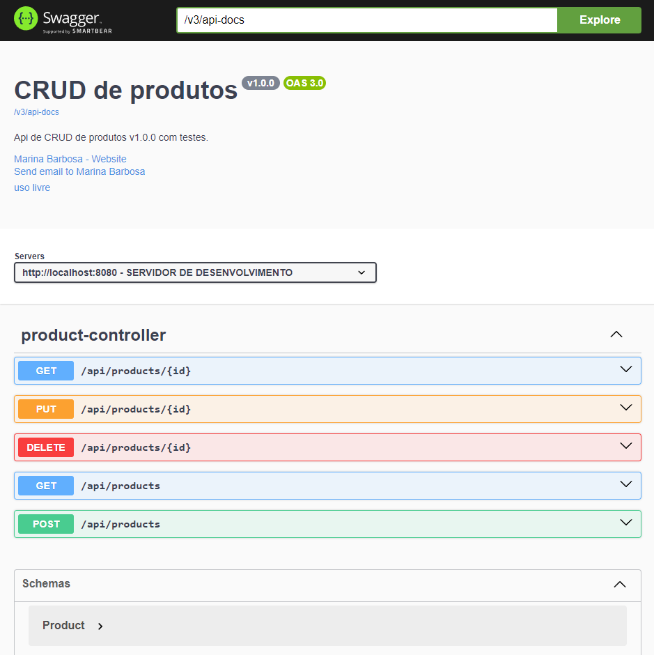
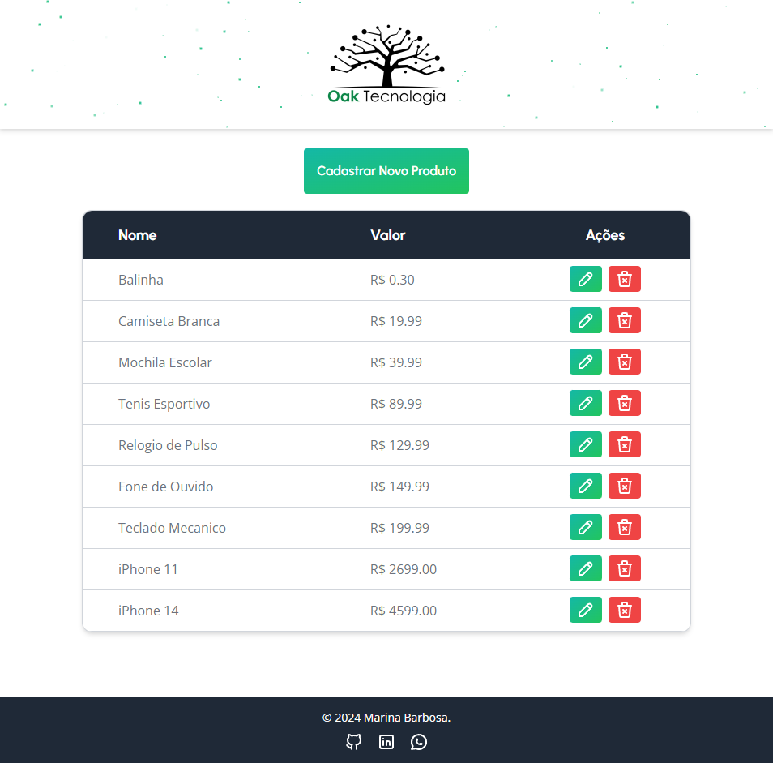
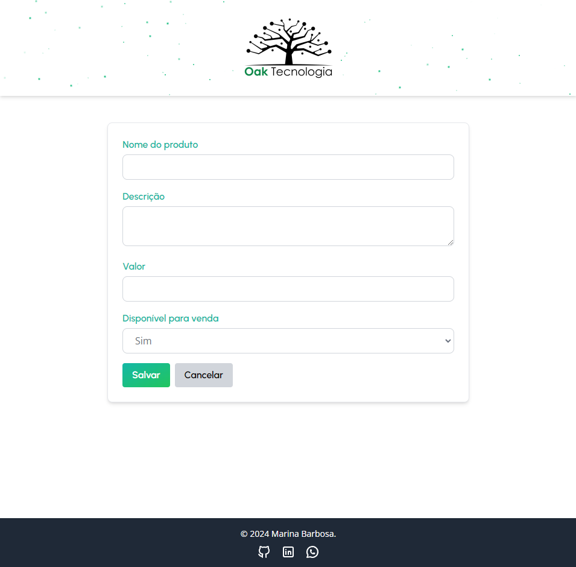

# oak-dev-backend

Prova experimental de qualificação de candidato Estágio de desenvolvimento na Oak tecnologia

CRUD Produtos.

Deploy: https://oak-dev-backend.onrender.com/swagger-ui/index.html

Frontend: https://oakdev.netlify.app/


<br>







<br>

## Endpoints

### - Listar todos os produtos

**GET** `/api/products`

**Response:**

```
[
  {
    "id": 1,
    "name": "Produto A",
    "description": "Descrição do Produto A",
    "price": 10.99,
    "availableForSale": true
  },
  {
    "id": 2,
    "name": "Produto B",
    "description": "Descrição do Produto B",
    "price": 25.50,
    "availableForSale": true
  }
]
```

<br>
<br>

### - Buscar um produto pelo ID

**GET** `/api/products/{id}`

- Busca e retorna os detalhes de um produto específico pelo seu ID.

**Parâmetros:**

- `id`: ID do produto.

**Response:**
```
{
  "id": 1,
  "name": "Produto A",
  "description": "Descrição do Produto A",
  "price": 10.99,
  "availableForSale": true
}
```

<br>
<br>

### - Criar um novo produto

**POST** `/api/products`

- Cria um novo produto com base nas informações fornecidas no corpo da requisição.

**Corpo da requisição:**
```
{
  "name": "Novo Produto",
  "description": "Descrição do novo produto",
  "price": 50.00,
  "availableForSale": true
}
```

**Response:**
```
{
  "id": 3,
  "name": "Novo Produto",
  "description": "Descrição do novo produto",
  "price": 50.00,
  "availableForSale": true
}
```

<br>
<br>

### - Atualizar um produto

**PUT** `/api/products/{id}`

- Atualiza os detalhes de um produto existente com base no ID fornecido.

**Parâmetros:**

- `id`: ID do produto a ser atualizado.

**Corpo da requisição:**
```
{
  "name": "Produto Atualizado",
  "description": "Descrição atualizada",
  "price": 20.00,
  "availableForSale": false
}
```

**Response:**
```
{
  "id": 1,
  "name": "Produto Atualizado",
  "description": "Descrição atualizada",
  "price": 20.00,
  "availableForSale": false
}
```

<br>
<br>

### - Excluir um produto

**DELETE** `/api/products/{id}`

- Exclui um produto com base no ID fornecido.

**Parâmetros:**

- `id`: ID do produto a ser excluído.

**Response:**
```
{
  "message": "Produto excluído com sucesso"
}
```

<br>
<br>

## Validações

- O nome e a descrição do produto são obrigatórios.
- O preço deve ser maior que zero.

**Exemplo de erro:**
```
{
  "message": "Price must be greater than zero"
}
```

<br>
<br>

## Tecnologias

- **Java 17**: Linguagem de programação utilizada para desenvolver a aplicação.
- **Spring Boot 3.3.4**: Framework para desenvolvimento de aplicações Java.
- **Spring Data JPA**: Facilita o uso de JPA (Java Persistence API) para acesso a dados.
- **Spring Web**: Para criar a API REST.
- **H2 Database**: Banco de dados em memória utilizado para desenvolvimento e testes.
- **PostgreSQL**: Banco de dados relacional utilizado em produção.
- **Lombok**: Biblioteca para simplificação de código Java, como getters, setters e construtores.
- **Jakarta Validation**: Biblioteca para validação de dados.
- **Spring Boot DevTools**: Ferramenta para facilitar o desenvolvimento, com funcionalidades como hot-reload.
- **JUnit & Mockito**: Frameworks de testes unitários e de mocks.
- **SpringDoc OpenAPI**: Para gerar a documentação da API automaticamente.

<br>
<br>

## Como executar o projeto

1. Clone o repositório:
`git clone git@github.com:marina-barbosa/oak-dev-backend.git`

2. Navegue até o diretório do projeto:
`cd projeto`

3. Certifique-se de que o `PostgreSQL` está configurado e rodando.

4. O projeto utiliza o perfil prod por padrão. Certifique-se de que está rodando no perfil desejado, como dev ou test, ajustando a variável `APP_PROFILE` no arquivo `application.properties`.

5. Compile e execute o projeto:
`mvn spring-boot:run`


<br>
<br>


A API estará disponível em:

 http://localhost:8080/

 https://oak-dev-backend.onrender.com/swagger-ui/index.html

## License

Este projeto está licenciado sob a [MIT License](LICENSE).

